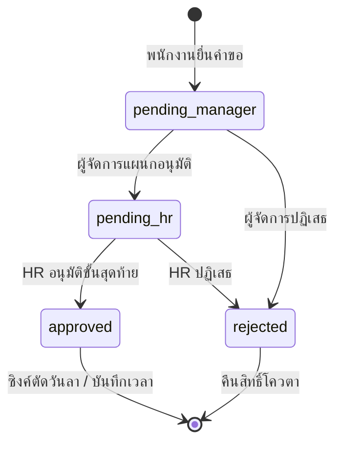

# DayHub HRMS - System Analysis & Enhancement Architecture
> เอกสารวิเคราะห์ข้อบกพร่อง แนวทางการพัฒนา และ Business Logic สำหรับยกระดับระบบ DayHub สู่มาตรฐาน Enterprise Production-Ready

---

## 1. การคำนวณวันลาไม่รวมวันหยุด (Holidays & Weekends Exclusion)

### 1.1 ปัญหาปัจจุบัน
ปัจจุบันระบบคำนวณจำนวนวันลาด้วยวิธี:
```php
$daysCount = $start->diffInDays($end) + 1;
```
การคำนวณนี้เป็นการนับวันตามปฏิทินทั้งหมด หากพนักงานลาตั้งแต่วันศุกร์ถึงวันจันทร์ จะถูกหัก 4 วัน (ศุกร์, เสาร์, อาทิตย์, จันทร์) ทำให้โควตาวันลาถูกหักเกินจริง 2 วัน

### 1.2 โครงสร้างตาราง (Database Schema)
สร้างตาราง `company_holidays` สำหรับจัดการวันหยุดนักขัตฤกษ์และวันหยุดพิเศษประจำปี:
```sql
CREATE TABLE company_holidays (
    id BIGINT AUTO_INCREMENT PRIMARY KEY,
    name VARCHAR(255) NOT NULL COMMENT 'ชื่อวันหยุด เช่น วันสงกรานต์, วันแรงงาน',
    holiday_date DATE NOT NULL UNIQUE COMMENT 'วันที่หยุด',
    is_recurring BOOLEAN DEFAULT FALSE COMMENT 'เกิดซ้ำทุกปีหรือไม่',
    created_at TIMESTAMP NULL,
    updated_at TIMESTAMP NULL
);
```

### 1.3 Business Logic การคำนวณ
เมื่อพนักงานเลือก `start_date` และ `end_date`:
1. ดึงรายการวันหยุดนักขัตฤกษ์จาก `company_holidays` ในช่วงเวลาดังกล่าว
2. ใช้ลูปตรวจสอบทีละวันตั้งแต่วันเริ่มต้นจนถึงวันสิ้นสุด:
   - ถ้าตรงกับวันเสาร์ (`$date->isSaturday()`) หรือวันอาทิตย์ (`$date->isSunday()`) ➔ **ข้าม ไม่นับวันลา**
   - ถ้าตรงกับวันหยุดในตาราง `company_holidays` ➔ **ข้าม ไม่นับวันลา**
   - ถ้าเป็นวันทำงานปกติ ➔ **นับ `$daysCount++`**
3. ตรวจสอบว่า `$daysCount` ต้องมากกว่า 0 (กรณีเลือกเฉพาะวันเสาร์-อาทิตย์ จะไม่อนุญาตให้ยื่น)
4. นำ `$daysCount` ที่ได้ไปตรวจสอบกับโควตาคงเหลือ (`remaining_days`) ก่อนบันทึกคำขอ

---

## 2. การลงเวลาเข้า-ออกงานข้ามวัน / กะดึก (Cross-Day Checkout / Night Shift)

### 2.1 ปัญหาปัจจุบัน
ระบบดึงข้อมูลเช็คอิน/เช็คเอาต์โดยค้นหา `date = today` เสมอ ทำให้กรณีพนักงานเข้ากะดึก เช่น เข้างาน 22:00 น. วันที่ 20 และเลิกงาน 06:00 น. วันที่ 21 เมื่อพนักงานกดหน้าเช็คเอาต์ตอนเช้า ระบบจะไม่พบ Record เข้างานของเมื่อคืน และบังคับให้เช็คอินใหม่ของวันที่ 21

### 2.2 Business Logic ในการแก้ไข
ปรับเงื่อนไขการค้นหาใน `AttendanceController`:
```php
// ดึงการลงเวลาที่ยังค้าง Check-out ย้อนหลังไม่เกิน 24 ชั่วโมง
$activeAttendance = Attendance::where('user_id', $user->id)
    ->whereNull('check_out')
    ->where('date', '>=', Carbon::now()->subHours(24)->toDateString())
    ->latest('id')
    ->first();
```
**ขั้นตอนการทำงาน (Workflow)**:
1. **ตอนเปิดหน้าลงเวลา**:
   - ถ้าพบ `$activeAttendance` ที่มี `check_in` แล้วแต่ยังไม่มี `check_out`:
     - แสดงปุ่ม **"บันทึกเวลาเลิกงาน (Check-out)"** พร้อมแสดงเวลาที่เข้างานของกะเดิม
     - ปิดปุ่ม "บันทึกเวลาเข้างาน" ชั่วคราวเพื่อป้องกันการกดซ้ำ
2. **ตอนกดยืนยันเลิกงาน**:
   - บันทึกเวลาปัจจุบันลงในคอลัมน์ `check_out` ของ Record เดิมนั้น แม้วันที่ปัจจุบันจะไม่ตรงกับคอลัมน์ `date` ก็ตาม
   - คำนวณชั่วโมงการทำงานสุทธิ (`total_hours = check_out - check_in`)

---

## 3. การขอปรับปรุงเวลาทำงานย้อนหลัง (Attendance Adjustment Request)

### 3.1 วัตถุประสงค์
รองรับกรณีพนักงานลืมสแกนเวลา, ติดภารกิจนอกสถานที่เช้า/เย็น, หรือระบบเครือข่ายมีปัญหา ให้สามารถยื่นขอแก้ไขเวลาทำงานโดยต้องผ่านการอนุมัติจากหัวหน้างาน

### 3.2 โครงสร้างตาราง (Database Schema)
```sql
CREATE TABLE attendance_adjustments (
    id BIGINT AUTO_INCREMENT PRIMARY KEY,
    user_id BIGINT NOT NULL,
    attendance_id BIGINT NULL COMMENT 'ผูกกับ attendance เดิม (ถ้ามี)',
    target_date DATE NOT NULL COMMENT 'วันที่ที่ต้องการขอปรับเวลา',
    requested_check_in TIME NULL COMMENT 'เวลาเข้างานที่ขอปรับ',
    requested_check_out TIME NULL COMMENT 'เวลาเลิกงานที่ขอปรับ',
    reason TEXT NOT NULL COMMENT 'เหตุผลความจำเป็น',
    attachment_url VARCHAR(255) NULL COMMENT 'หลักฐานแนบ',
    status ENUM('pending', 'approved', 'rejected') DEFAULT 'pending',
    approver_id BIGINT NULL,
    approved_at TIMESTAMP NULL,
    reject_reason TEXT NULL,
    created_at TIMESTAMP NULL,
    updated_at TIMESTAMP NULL,
    FOREIGN KEY (user_id) REFERENCES users(id) ON DELETE CASCADE
);
```

### 3.3 Business Logic
1. **พนักงานยื่นคำขอ**:
   - เลือกวันที่ย้อนหลัง (ไม่เกิน 30 วัน), ระบุเวลาเข้า-ออกจริง, กรอกเหตุผล
2. **หัวหน้างาน/HR พิจารณา**:
   - หาก **"อนุมัติ"**: ระบบจะไป `updateOrCreate` ข้อมูลในตาราง `attendances` ของวันนั้นทันที พร้อมคำนวณสถานะ `on_time` หรือ `late` ตามเวลาที่ขอปรับ และใส่หมายเหตุว่า "ปรับปรุงย้อนหลังโดยการอนุมัติ #ID"
   - หาก **"ปฏิเสธ"**: บันทึกเหตุผลการปฏิเสธ และแจ้งสถานะกลับไปยังพนักงาน

---

## 4. การตรวจสอบคำขอ OT เทียบกับเวลาเลิกงานจริง (Overtime & Check-out Validation)

### 4.1 ปัญหาปัจจุบัน
พนักงานสามารถยื่นขอ OT เช่น 18:00 - 20:00 น. (2 ชั่วโมง) ได้รับการอนุมัติแล้ว แต่ในความเป็นจริงอาจสแกนนิ้วเลิกงานตั้งแต่ 18:30 น. ทำให้เกิดการเบิกเงินค่าล่วงเวลาเกินจริง

### 4.2 Business Logic & Validation Rule
เมื่อ HR หรือผู้จัดการเปิดหน้าตรวจสอบและอนุมัติ OT:
1. ระบบนำ `user_id` และ `ot_date` ไป Query ตาราง `attendances` เพื่อดึงเวลา `check_out` จริงของวันนั้น
2. **เปรียบเทียบเวลา (Time Comparison Logic)**:
   - **กรณีปกติ (Valid)**: เวลา `check_out` จริง >= เวลาสิ้นสุดของ OT ที่ขอ (เช่น OT ขอถึง 20:00, เลิกงานจริง 20:10) ➔ แสดงแท็กสีเขียว `✓ เลิกงานจริง 20:10 น.`
   - **กรณีเลิกงานก่อนเวลา (Warning/Invalid)**: เวลา `check_out` จริง < เวลาสิ้นสุดของ OT (เช่น OT ขอถึง 20:00, เลิกงานจริง 18:45) ➔ แสดงแท็กแจ้งเตือนสีแดง `⚠️ สแกนออกก่อนเวลา OT (18:45 น.)`
   - **กรณีไม่มีเวลาเลิกงาน (No Check-out)**: ➔ แจ้งเตือนสีเหลือง `⚠️ ไม่พบข้อมูลเวลาเลิกงานของวันดังกล่าว`
3. **ระบบ Auto-Trim (ทางเลือก)**:
   - มีปุ่มให้ HR เลือก "ปรับชั่วโมง OT ตามเวลาเลิกงานจริงอัตโนมัติ" เพื่อไม่ให้เบิกเกินจริง

---

## 5. สายการอนุมัติตามระดับชั้น (Multi-Level Approval: Manager ➔ HR)

### 5.1 โครงสร้างลำดับชั้น
1. ในตาราง `departments` เพิ่มคอลัมน์ `manager_id` (หัวหน้าแผนก)
2. สิทธิ์การมองเห็น:
   - **Department Manager**: มองเห็นและมีสิทธิ์อนุมัติเฉพาะพนักงานที่อยู่ในแผนกที่ตนเองดูแล
   - **HR / Admin**: มีสิทธิ์อนุมัติขั้นสุดท้าย และดูแลพนักงานทุกแผนก

### 5.2 สถานะคำขอ (State Machine Logic)

- **เงื่อนไขพิเศษ**:
  - หากผู้ยื่นคำขอคือตัว "Department Manager" เอง ➔ ข้ามขั้นแรก วิ่งตรงไปที่ `pending_hr` ทันที
  - ป้องกัน Self-Approval (ไม่สามารถอนุมัติคำขอของตนเองได้)

---

## 6. ระบบการแจ้งเตือน (Notifications System)

### 6.1 ช่องทางที่แนะนำ: LINE Notify / LINE Messaging API
เหตุผลที่แนะนำ LINE:
- คนไทยใช้งานกว่า 95% อัตราการเปิดอ่านสูงกว่า Email ทันทีภายใน 1-3 นาที
- สามารถยิงเข้ากลุ่มเฉพาะ เช่น กลุ่ม "ผู้จัดการอนุมัติใบลา" หรือกลุ่ม "HR Alert"

### 6.2 Logic การส่งข้อความแจ้งเตือน (Trigger Points)
1. **เมื่อมีคำขอใหม่ (New Request Trigger)**:
   - ส่งแจ้งเตือนหาผู้จัดการ:
     > 🔔 **มีคำขอลาใหม่**  
     > พนักงาน: นายสมชาย ใจดี (แผนก IT)  
     > ประเภท: ลาป่วย (2 วัน)  
     > วันที่: 22/09/2026 - 23/09/2026  
     > ลิงก์พิจารณา: https://yourdomain.com/leaves-approvals
2. **เมื่อคำขอได้รับการอนุมัติ / ปฏิเสธ (Status Update Trigger)**:
   - ส่งแจ้งเตือนกลับหาพนักงานเจ้าของคำขอ เพื่อรับทราบผลทันที

---

## 7. ระบบส่งออกข้อมูลและรายงาน (Excel / CSV Reporting)

### 7.1 ขอบเขตการทำงาน
เพิ่มปุ่ม **"Export Excel / CSV"** ใน 2 หน้าสำคัญ:
1. `attendance/report`: รายงานสรุปเวลาทำงานของพนักงานทุกคนตามช่วงวันที่และแผนก
2. `leaves/index`: รายงานสรุปประวัติการลาและโควตาวันลาคงเหลือ

### 7.2 Logic การ Implement ด้วย StreamedResponse (High Performance)
เพื่อไม่ให้เซิร์ฟเวอร์กิน RAM สูงเมื่อข้อมูลมีหลายพันแถว และไม่ต้องลง Library เสริมหนักๆ:
```php
public function exportAttendanceCsv(Request $request)
{
    $fileName = 'attendance_report_' . date('Ymd_His') . '.csv';
    $headers = [
        "Content-type"        => "text/csv; charset=UTF-8",
        "Content-Disposition" => "attachment; filename=$fileName",
        "Pragma"              => "no-cache",
        "Cache-Control"       => "must-revalidate, post-check=0, pre-check=0",
        "Expires"             => "0"
    ];

    $callback = function() use ($request) {
        $file = fopen('php://output', 'w');
        // ใส่ UTF-8 BOM เพื่อให้เปิดภาษาไทยใน Excel ได้สมบูรณ์ ไม่เป็นภาษาต่างดาว
        fputs($file, "\xEF\xBB\xBF");
        
        // Header แถวแรก
        fputcsv($file, ['รหัสพนักงาน', 'ชื่อ-นามสกุล', 'แผนก', 'วันที่', 'เวลาเข้า', 'เวลาออก', 'สถานะ', 'หมายเหตุ']);

        // ดึงข้อมูลและทยอยเขียนลง Stream
        $data = $this->getFilteredReportData($request);
        foreach ($data as $row) {
            fputcsv($file, [
                $row->emp_code,
                $row->name,
                $row->department_name,
                $row->date,
                $row->check_in,
                $row->check_out,
                $row->status,
                $row->notes
            ]);
        }
        fclose($file);
    };

    return response()->stream($callback, 200, $headers);
}
```

---

## 8. สรุปภาพรวมแผนการพัฒนา (Implementation Roadmap)

| ระยะการพัฒนา | ฟีเจอร์ที่พัฒนา | ประโยชน์ที่ได้รับ |
| :--- | :--- | :--- |
| **ระยะที่ 1 (High Impact & Quick Win)** | 1. ตารางวันหยุดนักขัตฤกษ์ + คำนวณวันลาหักเสาร์-อาทิตย์<br>2. ระบบ Export รายงาน CSV/Excel รองรับภาษาไทย | ข้อมูลวันลาตรงตามจริง 100%, HR นำข้อมูลไปใช้ต่อได้ทันที |
| **ระยะที่ 2 (Operations & Control)** | 1. การตรวจเวลา Check-out จริงเทียบคำขอ OT<br>2. การลงเวลาข้ามวันสำหรับกะกลางคืน (Night Shift) | ลดการทุจริต OT, รองรับพนักงานเข้ากะ |
| **ระยะที่ 3 (Workflow & Automation)** | 1. สายอนุมัติ 2 ขั้น (Manager ➔ HR)<br>2. ระบบยื่นขอปรับเวลาทำงานย้อนหลัง<br>3. แจ้งเตือนผ่าน LINE Notify | ลดภาระ HR รวมศูนย์, ไม่ตกหล่นการแจ้งเตือน |
