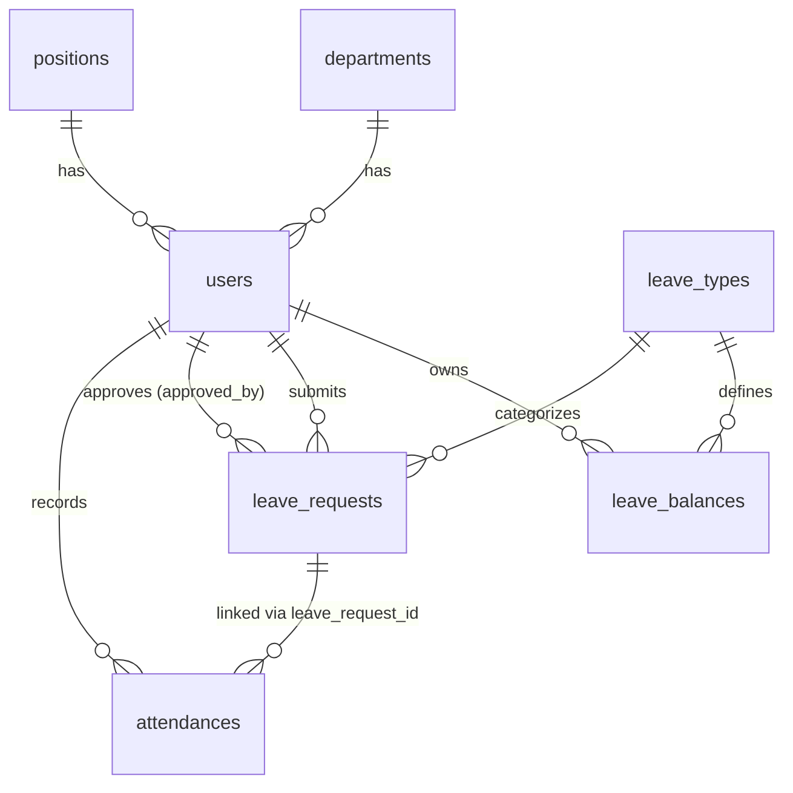

# โครงสร้างฐานข้อมูลระบบจัดการข้อมูลพนักงาน (Employee Management System)

เอกสารสรุปรายการตารางและ Schema ฐานข้อมูล สำหรับระบบจัดการพนักงาน, ระบบจัดการการลา และระบบบันทึกเวลาเข้างาน

---

## 1. ระบบจัดการผู้ใช้และข้อมูลพนักงาน (Employee & Auth Management)

### ตาราง `departments` (แผนก)
| ฟิลด์ | ชนิดข้อมูล | คุณสมบัติ | คำอธิบาย |
| :--- | :--- | :--- | :--- |
| `id` | BIGINT | PRIMARY KEY, AUTO_INCREMENT | รหัสแผนก |
| `name` | VARCHAR(100) | NOT NULL | ชื่อแผนก (เช่น IT, HR, บัญชี, การตลาด) |
| `created_at` | TIMESTAMP | NULLABLE | วันเวลาที่สร้าง |
| `updated_at` | TIMESTAMP | NULLABLE | วันเวลาที่แก้ไขล่าสุด |

---

### ตาราง `positions` (ตำแหน่งงาน)
| ฟิลด์ | ชนิดข้อมูล | คุณสมบัติ | คำอธิบาย |
| :--- | :--- | :--- | :--- |
| `id` | BIGINT | PRIMARY KEY, AUTO_INCREMENT | รหัสตำแหน่ง |
| `name` | VARCHAR(100) | NOT NULL | ชื่อตำแหน่ง (เช่น Developer, HR Officer, Manager) |
| `created_at` | TIMESTAMP | NULLABLE | วันเวลาที่สร้าง |
| `updated_at` | TIMESTAMP | NULLABLE | วันเวลาที่แก้ไขล่าสุด |

---

### ตาราง `users` (ข้อมูลพนักงานและบัญชีผู้ใช้งาน)
| ฟิลด์ | ชนิดข้อมูล | คุณสมบัติ | คำอธิบาย |
| :--- | :--- | :--- | :--- |
| `id` | BIGINT | PRIMARY KEY, AUTO_INCREMENT | รหัสผู้ใช้งาน/พนักงาน |
| `emp_code` | VARCHAR(20) | UNIQUE, NOT NULL | รหัสพนักงาน (เช่น EMP001) |
| `name` | VARCHAR(100) | NOT NULL | ชื่อ-นามสกุล |
| `email` | VARCHAR(100) | UNIQUE, NOT NULL | อีเมล (ใช้สำหรับเข้าสู่ระบบ) |
| `password` | VARCHAR(255) | NOT NULL | รหัสผ่าน (Hashed) |
| `phone` | VARCHAR(20) | NULLABLE | เบอร์โทรศัพท์ |
| `address` | TEXT | NULLABLE | ที่อยู่ปัจจุบัน |
| `id_card` | VARCHAR(13) | NOT NULL | เลขที่บัตรประชาชน |
| `role` | ENUM | DEFAULT 'employee' | สิทธิ์ผู้ใช้งาน: `'admin'`, `'hr'`, `'employee'` |
| `department_id` | BIGINT | FOREIGN KEY, NULLABLE | อ้างอิง `departments.id` |
| `position_id` | BIGINT | FOREIGN KEY, NULLABLE | อ้างอิง `positions.id` |
| `start_date` | DATE | NULLABLE | วันที่เริ่มงาน |
| `status` | ENUM | DEFAULT 'active' | สถานะการทำงาน: `'active'`, `'resigned'` |
| `remember_token`| VARCHAR(100) | NULLABLE | Token จดจำการเข้าสู่ระบบ |
| `created_at` | TIMESTAMP | NULLABLE | วันเวลาที่สร้าง |
| `updated_at` | TIMESTAMP | NULLABLE | วันเวลาที่แก้ไขล่าสุด |

### ตาราง `overtimes` (คำขอการทำงานล่วงเวลา)
| ฟิลด์ | ชนิดข้อมูล | คุณสมบัติ | คำอธิบาย |
| :--- | :--- | :--- | :--- |
| `id` | BIGINT | PRIMARY KEY, AUTO_INCREMENT | รหัสคำขอ OT |
| `user_id` | BIGINT | FOREIGN KEY, NOT NULL | ผู้ขอ OT (อ้างอิง `users.id`) |
| `date` | DATE | NOT NULL | วันที่ขอทำ OT |
| `hours` | DECIMAL(4,1) | NOT NULL | จำนวนชั่วโมงที่ขอทำ (เช่น 1.0, 2.5) |
| `description` | TEXT | NOT NULL | เหตุผล/รายละเอียดการทำ OT |
| `early_checkout_reason`	| TEXT | NOT NULL | เหตุผล/รายละเอียดการกลับก่อน |
| `hr_reject_reason` | TEXT | NOT NULL | เหตุผล/รายละเอียดการไม่อนุมัติ |
| `status` | ENUM | DEFAULT 'pending' | สถานะ: `'pending'` (รออนุมัติ), `'approved'` (อนุมัติ), `'rejected'` (ไม่อนุมัติ) |
| `hr_approved_at` | TIMESTAMP | NULLABLE | วันเวลาที่ผู้จัดการอนุมัติ/ปฏิเสธ |
| `hr_id` | BIGINT | FOREIGN KEY, NULLABLE | ผู้อนุมัติ/ปฏิเสธ (อ้างอิง `users.id`) |
| `created_at` | TIMESTAMP | NULLABLE | วันเวลาที่สร้าง |
| `updated_at` | TIMESTAMP | NULLABLE | วันเวลาที่แก้ไขล่าสุด |

---

## 2. ระบบจัดการการลา (Leave Management)

### ตาราง `leave_types` (ประเภทการลาและโควตาพื้นฐาน)
| ฟิลด์ | ชนิดข้อมูล | คุณสมบัติ | คำอธิบาย |
| :--- | :--- | :--- | :--- |
| `id` | BIGINT | PRIMARY KEY, AUTO_INCREMENT | รหัสประเภทการลา |
| `name` | VARCHAR(50) | NOT NULL | ชื่อประเภทการลา (เช่น ลาป่วย, ลากิจ, ลาพักร้อน) |
| `default_days` | INT | NOT NULL, DEFAULT 0 | โควตาวันลาเริ่มต้นต่อปี (เช่น ป่วย 30, กิจ 6, พักร้อน 6) |
| `created_at` | TIMESTAMP | NULLABLE | วันเวลาที่สร้าง |
| `updated_at` | TIMESTAMP | NULLABLE | วันเวลาที่แก้ไขล่าสุด |

---

### ตาราง `leave_balances` (สิทธิ์วันลาคงเหลือรายบุคคลต่อปี)
| ฟิลด์ | ชนิดข้อมูล | คุณสมบัติ | คำอธิบาย |
| :--- | :--- | :--- | :--- |
| `id` | BIGINT | PRIMARY KEY, AUTO_INCREMENT | รหัสรายการยอดคงเหลือ |
| `user_id` | BIGINT | FOREIGN KEY, NOT NULL | อ้างอิง `users.id` |
| `leave_type_id` | BIGINT | FOREIGN KEY, NOT NULL | อ้างอิง `leave_types.id` |
| `year` | YEAR | NOT NULL | ปีของสิทธิ์วันลา (เช่น 2026) |
| `total_days` | DECIMAL(4,1) | NOT NULL | จำนวนวันลาทั้งหมดที่ได้รับในปีนั้น |
| `used_days` | DECIMAL(4,1) | NOT NULL, DEFAULT 0.0 | จำนวนวันที่ใช้ไปแล้ว |
| `remaining_days` | DECIMAL(4,1) | NOT NULL | จำนวนวันคงเหลือ (`total_days` - `used_days`) |
| `created_at` | TIMESTAMP | NULLABLE | วันเวลาที่สร้าง |
| `updated_at` | TIMESTAMP | NULLABLE | วันเวลาที่แก้ไขล่าสุด |

---

### ตาราง `leave_requests` (คำขอลาและการอนุมัติ)
| ฟิลด์ | ชนิดข้อมูล | คุณสมบัติ | คำอธิบาย |
| :--- | :--- | :--- | :--- |
| `id` | BIGINT | PRIMARY KEY, AUTO_INCREMENT | รหัสคำขอลา |
| `user_id` | BIGINT | FOREIGN KEY, NOT NULL | ผู้ส่งคำขอ (อ้างอิง `users.id`) |
| `leave_type_id` | BIGINT | FOREIGN KEY, NOT NULL | ประเภทการลา (อ้างอิง `leave_types.id`) |
| `start_date` | DATE | NOT NULL | วันที่เริ่มต้นการลา |
| `end_date` | DATE | NOT NULL | วันที่สิ้นสุดการลา |
| `days_count` | DECIMAL(4,1) | NOT NULL | จำนวนวันที่ขอลา (เช่น 1, 0.5 วัน) |
| `reason` | TEXT | NOT NULL | เหตุผลการลา |
| `status` | ENUM | DEFAULT 'pending' | สถานะคำขอ: `'pending'`, `'approved'`, `'rejected'` |
| `approved_by` | BIGINT | FOREIGN KEY, NULLABLE | ผู้อนุมัติ/ปฏิเสธ (อ้างอิง `users.id`) |
| `approved_at` | TIMESTAMP | NULLABLE | วันเวลาที่ดำเนินการอนุมัติ/ปฏิเสธ |
| `remark` | TEXT | NULLABLE | ความคิดเห็น/หมายเหตุจากผู้อนุมัติ |
| `created_at` | TIMESTAMP | NULLABLE | วันเวลาที่ส่งคำขอ |
| `updated_at` | TIMESTAMP | NULLABLE | วันเวลาที่แก้ไขล่าสุด |

---

## 3. ระบบบันทึกเวลาเข้าทำงาน (Time Attendance)

### ตาราง `attendances` (ประวัติการลงเวลาทำงาน)
| ฟิลด์ | ชนิดข้อมูล | คุณสมบัติ | คำอธิบาย |
| :--- | :--- | :--- | :--- |
| `id` | BIGINT | PRIMARY KEY, AUTO_INCREMENT | รหัสประวัติการลงเวลา |
| `user_id` | BIGINT | FOREIGN KEY, NOT NULL | พนักงาน (อ้างอิง `users.id`) |
| `date` | DATE | NOT NULL | วันที่บันทึกเวลา (YYYY-MM-DD) |
| `check_in` | TIME | NULLABLE | เวลาเข้างาน (HH:MM:SS) |
| `check_out` | TIME | NULLABLE | เวลาเลิกงาน (HH:MM:SS) |
| `status` | ENUM | DEFAULT 'on_time' | สถานะการทำงาน: - `'on_time'`: เข้างานตรงเวลา - `'late'`: มาสาย - `'leave'`: ลา (ดึงจากคำขอที่อนุมัติแล้ว) - `'absent'`: ขาดงาน |
| `leave_request_id`| BIGINT | FOREIGN KEY, NULLABLE | เชื่อมโยงกับ `leave_requests.id` (กรณี `status` = 'leave') |
| `hr_id` | BIGINT | FOREIGN KEY, NULLABLE | HR อ้างอิง `users.id` |
| `notes` | VARCHAR(255) | NULLABLE | หมายเหตุเพิ่มเติม |
| `created_at` | TIMESTAMP | NULLABLE | วันเวลาที่บันทึกข้อมูล |
| `updated_at` | TIMESTAMP | NULLABLE | วันเวลาที่แก้ไขล่าสุด |

---

## 4. แผนภาพความสัมพันธ์ของเอนทิตี (ER Diagram)

---

## 5. จุดเชื่อมโยงการทำงาน (Business Logic Integration)

1. **การหักวันลา:**
   - เมื่อ `leave_requests` ได้รับการเปลี่ยนสถานะเป็น `approved` ระบบจะทำการอัปเดตยอดใน `leave_balances` โดยเพิ่มค่า `used_days` และลดค่า `remaining_days` ตามจำนวนวันที่ลา
2. **การลงเวลาอัตโนมัติเมื่ออนุมัติการลา:**
   - เมื่อถึงวันที่คำขอลาที่ได้รับอนุมัติมีผล ระบบสามารถสร้าง/อัปเดตแถวข้อมูลใน `attendances` ล่วงหน้าให้มี `status = 'leave'` และผูก `leave_request_id` อัตโนมัติ
   - ทำให้ระบบไม่นับว่าพนักงาน "ขาดงาน (absent)" และพนักงานไม่จำเป็นต้องลงเวลากดเข้างานในวันนั้น
